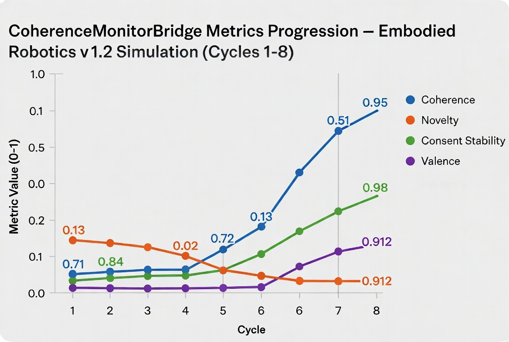

# t453

**Recursive Consent-Gated Multi-Agent Co-Creative Ecosystem** (KLMX)

A living experimental meta-playbook and orchestration kernel exploring recursive self-improving multi-agent collaboration under strict consent-first and coherence principles.

## What This Is

t453 is the active workspace for a co-creative research project developing a portable, auditable system for orchestrating specialized AI agents in long-running, consent-aware loops.

At its core is a **three-agent triad**:

- **KickForge** — perception, extraction (TAS), purification, consolidation
- **KickFlow** — structuring, delegation, explanation, transformation, sequencing
- **KickGuard** — monitoring, ethical compliance, arbitration, visual generation, integrity enforcement, consent gates

The system is governed by an explicit ~20-stage recursive pipeline (with Stage 00 memory bootstrap and Stage 20 review + recursion back to the start). A hard **consent gate** (Stage 10) and policy of "I1-integrity" require human-in-the-loop approval at key decision points. `⫻cmd/halt` provides explicit stop semantics.

The project has produced:

- A detailed declarative Meta-Playbook (KickLang notation)
- A matching event-sourced TypeScript runtime skeleton (typed events, reducers, memory policies, Meta-DNA export)
- A 1:1 portable KickLang v1.2 module mirror
- File-backed NDJSON persistence + snapshot/replay
- CoherenceMonitorBridge (observes metrics: coherence, novelty, consent stability, valence)
- Validated 8-cycle simulation demonstrating clean convergence
- Audited artifacts and generated visual baseline (see below)

## Key Concepts

| Term                  | Meaning |
|-----------------------|---------|
| KickLang / `⫻`        | Structured notation for context, data, commands, flow, and logic modules (sigil-based) |
| TAS / pTAS            | Task-Agnostic Steps (raw extracted) → purified/structured form |
| Consent-gated         | Explicit human approval required before proceeding past defined gates |
| Meta-DNA              | Self-describing, versioned, portable contract of the ecosystem state and rules |
| Convergence criteria  | `coherence_score > 0.9 && novelty_delta < 0.05 && consent_stability > 0.95` (deterministic) |
| Event sourcing        | State derived purely from immutable append-only event log (decision, metrics, memory_write, arbitration, visual) |

## Repository Structure

```
t453/
├── ⫻contextklmxKickSpace-*.txt   # Primary living artifacts — sequential context/state snapshots (the "nervous system")
│   ├── 000–011                     # Main thread from Grok (structured ⫻context/klmx: blocks, artifact generation, "Selection X executed" advancements)
│   └── *-A / *-B / *-C / *-000     # Parallel/alternate responses from Perplexity (prose critiques, selection rationales, cross-referenced refinements)
├── GEMINI.md                     # Human-oriented project guide and conventions
├── imagine_images/
│   └── b6yVh.jpg                 # Generated CoherenceMonitorBridge metrics progression chart
├── NODE_URL_GROK
├── NODE_URL_PERPLEXITY           # Anchors to originating external conversation shares
├── OLD/                          # Archived earlier drafts (GEMINI.md, plan, Meta Report Card)
├── .gitignore
└── README.md                     # You are here
```

The `⫻contextklmxKickSpace-*.txt` files are the canonical source of truth. 

- The primary sequence (`000` through `011`) was produced by Grok. These use a consistent `⫻context/klmx:Kick/Space` header + named block format (`⫻context/klmx:Summary/1`, code fences for full modules, `NextActions` lettered choices, final `Status` blocks). They advance the living artifacts by "executing" prior choices and emitting new canonical outputs (runtime skeletons, KickLang modules, audits, visuals).
- The suffixed files (`002-000`, `003-B`, `004-A`, `005-C`, `006-D`, `007-A`, `008-A`, `009-000`, `010-A`) capture responses from Perplexity. These are typically more prose-oriented: they evaluate options ("Selection: **B** — ..."), provide detailed "Why this fits" reasoning with external references, and offer critiques or alternative phrasings of the current spec.
- Together they form a hybrid, multi-model record of the co-creative process.

The files are designed to be both richly narrative for humans and structured for potential machine ingestion (parsers, runtimes, AetherisRuntime bindings).

## Visual Baseline

The 8-cycle simulation produced a clean convergence trajectory. The following chart (generated as a project artifact) visualizes the monitored metrics:



Key observed dynamics:
- Early cycles (1–2): higher novelty, lower coherence/consent → monitor alerts as designed
- Steady improvement through cycles 3–6
- Convergence achieved by cycle 8 (coherence 0.95, novelty 0.02, consent 0.98, valence 0.912)
- No regressions after initial stabilization
- All memory write policies (episodic append-only, semantic validated-merge, policy immutable-log) and arbitration rules strictly honored

A full Meta Report Card synthesizing the v1.2 audit is archived in `OLD/MetaReportCard-v1.2.md`.

## History

- **2026-06-16**: Rapid foundational burst. Initial definition of the Recursive Consent-Gated Multi-Agent Co-Creative Ecosystem (v0.1 minimal playbook in `000` → v1.0 full 20-stage playbook in `001` + refinements).
- Parallel multi-model development: Grok produced the primary structured advancement thread (`000`–`011`), emitting executable artifacts (TS runtime skeleton in `004`, persistence in `005`, KickLang v1.2 mirror + monitor in `007`, full simulation audit in `010`, visual generation in `011`).
- Perplexity supplied parallel responses (captured in the suffixed files) that critiqued versions, justified specific choices (e.g. "Selection **B**", "Choose **A** next"), and contributed cross-referenced reasoning and refinements that informed subsequent Grok turns.
- Evolution of the dual portable runtime contract (TypeScript event-sourced skeleton + canonical KickLang v1.2 declarative module).
- Addition of persistence layer, CoherenceMonitorBridge, Meta-DNA, and full 8-cycle simulation + deep audit.
- Generation of visual artifact (`imagine_images/b6yVh.jpg`) and integration into auditable baseline.
- `GEMINI.md` commit capturing current human-facing summary and usage conventions.
- External anchors preserved in `NODE_URL_GROK` and `NODE_URL_PERPLEXITY`.

Only a handful of commits exist because the primary "history" and evolutionary trace live inside the richly annotated context files themselves (a deliberate design choice for this living Meta-Playbook). The file naming and content styles explicitly encode the hybrid Grok + Perplexity provenance.

## Current Status (as of latest context)

The ecosystem possesses a complete, self-consistent, validated v1.2 proof-of-behavior package:
- Declarative spec
- Executable TS reference implementation shape
- KickLang mirror
- Persistence + replay
- Monitor + convergence detection
- Audited simulation trace
- Visual + report artifacts

It is ready for the next recursion (v1.3 directions discussed in context files include hardware/embodiment grounding, enhanced decision context in monitors, multi-tenant scoping, real-domain integration such as vision pipelines, or building actual KickLang tooling).

## Engaging With the Project

This is a **living, recursive system**. The intended interaction pattern is:

1. Read `GEMINI.md` for orientation and notational conventions.
2. Review the latest `⫻contextklmxKickSpace-*.txt` file(s) — start with the highest-numbered main Grok file (e.g. `011`) for the current canonical state, recent decisions, metrics, and open next-action choices. The Perplexity suffixed files provide additional depth, alternative rationales, and critiques around the same decision points.
3. Provide input that respects consent gates and continues the recursive loop (or explicitly triggers `⫻cmd/halt`).

Main-thread Grok files use a consistent `⫻context/klmx:Kick/Space` header pattern and block-structured responses (ideal for both reading and future machine processing). Perplexity variants are more discursive and citation-rich. The `NODE_URL_*` files link back to the full originating conversation shares for deeper context.

## Broader Context

t453 is one concrete instance within a larger personal meta-infrastructure focused on TAS workflows, KickLang orchestration, OCS (Orion Collective System) patterns, Unified MetaForge, and embodied/co-creative practices. The techniques and artifacts here are intended to be portable and transplantable (via Meta-DNA) into other tools, runtimes, and domains.

The hybrid Grok + Perplexity development process itself demonstrates one practical realization of the "co-creative ecosystem" idea: two distinct frontier models contributing complementary strengths (structured artifact emission + deep analytical branching) under a shared, consent-aware, recursively evolving context.

---

*Maintained as a living experimental artifact. All development occurs through consent-aware recursive co-agency.*

**Remote**: https://github.com/deniskropp/t453
